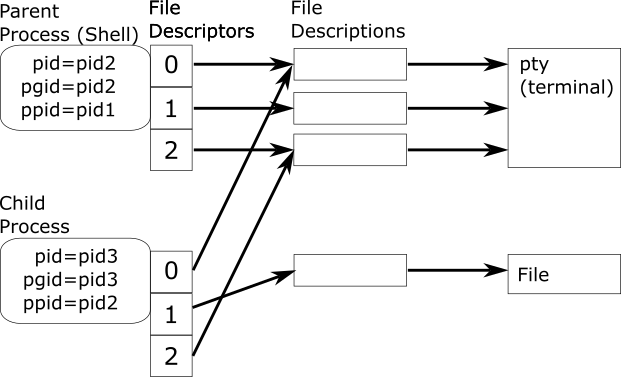
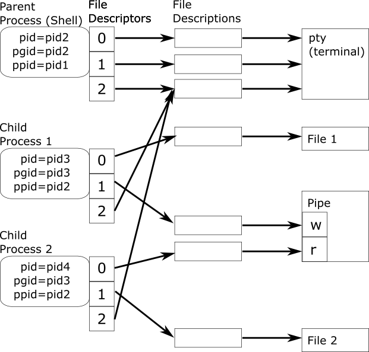
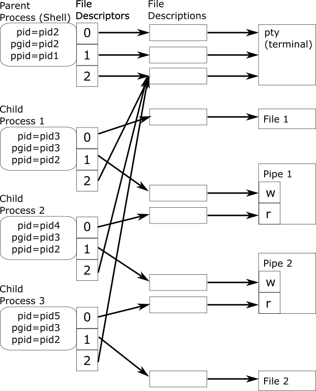

# Shell Lab - Pipelines and Redirection

The purpose of this assignment is to help you become more familiar with the
concepts of process creation, file descriptor duplication, input/output
redirection, and inter-process communication (IPC) using pipes.  To do this,
you will implement a shell like `bash` (GNU Bourne-Again SHell), which is used
in operating systems like Linux.  This shell will read commands from standard
input and run the programs specified in those commands.  It will also redirect
output to files and to other programs in a pipeline.


# Maintain Your Repository

 Before beginning:
 - [Mirror the class repository](../01a-hw-private-repo-mirror), if you haven't
   already.
 - [Merge upstream changes](../01a-hw-private-repo-mirror#update-your-mirrored-repository-from-the-upstream)
   into your private repository.

 As you complete the assignment:
 - [Commit changes to your private repository](../01a-hw-private-repo-mirror#commit-and-push-local-changes-to-your-private-repo).


# Table of Contents
- [Getting Started](#getting-started)
  - [Reading](#reading)
  - [Resources Provided](#resources-provided)
  - [Reference Tiny Shell](#reference-tiny-shell)
  - [Functionality Not Included](#functionality-not-included)
  - [Your Tiny Shell](#your-tiny-shell)
  - [`tsh.c` Overview](#tshc-overview)
- [Instructions](#instructions)
  - [`builtin_cmd()`](#builtin_cmd)
  - [`eval()`](#eval)
    - [Checkpoint 1](#checkpoint-1)
    - [Single Command](#single-command)
    - [Checkpoint 2](#checkpoint-2)
    - [Two Pipelined Commands](#two-pipelined-commands)
    - [Checkpoint 3](#checkpoint-3)
    - [A Pipeline with More Than Two Commands](#a-pipeline-with-more-than-two-commands)
    - [Checkpoint 4](#checkpoint-4)
- [Helper Functions](#helper-functions)
  - [`parseline()`](#parseline)
  - [`parseargs()`](#parseargs)
- [Debugging Hints](#debugging-hints)
- [Automated Testing](#automated-testing)
- [Evaluation](#evaluation)
- [Submission](#submission)


# Getting Started

This section is intended to familiarize you with the concepts associated with
the lab and the resources provided to help you complete it, including a
walk-through usage of the reference shell.  You will begin coding in the
[instructions](#instructions) section.

## Reading

Read the following in preparation for this assignment:

 - Sections 8.2 - 8.4 and 10.8 - 10.10 in the book

Additionally, man pages for the following are also referenced throughout the
assignment:

 - `fork(2)`
 - `pipe(2)`, `pipe(7)`
 - `dup2(2)`
 - `close(2)`
 - `waitpid(2)`
 - `exec(3)`
 - `execve(2)`
 - `setpgid(2)`


## Resources Provided

 - `tsh.c` - a file containing a functional skeleton of a simple shell (i.e.,
   "tiny shell").  This is where you will do your work!
 - `Makefile` - a file used by the `make` command for building, cleaning, and
   performing automated testing of your code.
 - `tshref` - a binary file containing a reference implementation of tiny
   shell to demonstrate correct behavior.
 - `sdriver.pl` - a Perl script that runs a trace file against your shell to
   test its functionality.
 - `checktsh.pl` - a Perl script that uses `sdriver.pl` to run one or more
   trace files against both your shell and the reference implementation to see
   if their behaviors differ.
 - `trace01.txt` - `trace03.txt` and `trace34.txt` - `trace42.txt` - trace
   files for testing various aspects of your shell.
 - C programs to be run from _within_ your shell for testing its functionality.
   - `myspin.c` - Runs a `sleep()` loop for as many seconds as are specified on
     the command line.  Used as a program that simply "runs" for a defined
     amount of time.
   - `myintgroup.c` - Runs a `sleep()` loop for as many seconds as are
     specified on the command line.  After that, causes all processes that are
     in the group as the current process to terminate.  Used to test group
     membership.
   - `myppid.c` - Simply prints the parent process ID (PPID) of the current
     process to standard output.
   - `mycat.c` - Behaves _exactly_ like the `/bin/cat` command, except that the
     first argument is an integer that specifies the number of seconds after
     which the program will terminate, even if it has not finished the end of
     its code, which in some cases means having read EOF from standard input.
   - `mygrep.c` - Behaves _exactly_ like the `/bin/grep` command, except that
     the first argument is an integer that specifies the number of seconds
     after which the program will terminate, even if it has not finished the
     end of its code, which in some cases means having read EOF from standard
     input.


## Reference Tiny Shell

This section walks through the reference shell behavior, so you know what you
will be implementing.  Run the reference shell by running the following from
your terminal:

```bash
./tshref
```

You will now see a prompt:

```bash
tsh>
```

Every time you type a command at the prompt, the shell will execute the command
and print the prompt again when the command is finished--an indicator that it
is ready to read and execute the next command.  For example:

```bash
tsh> /bin/sleep 10
tsh> /bin/echo foo bar
foo bar
tsh> 
```

Even though the first command took 10 seconds to complete, the prompt was not
returned until the command had completed.

But that's not all this shell can do!  It can also redirect a program's
standard output to a file--instead of the terminal--using the `>` operator:

```bash
tsh> /bin/echo foo bar > test.txt
tsh> /bin/cat test.txt
foo bar
tsh>
```

And it can make a program read standard input from a file--instead of the
terminal--using the `<` operator:

```bash
tsh> /bin/cat < test.txt
foo bar
tsh>
```

But wait -- there's more!  It can enable unidirectional communication between
concurrently running processes using pipes when two or more programs are
separated by the `|` operator on the command line:

```bash
tsh> /bin/echo foo bar | /bin/cat | /bin/grep foo
foo bar
tsh> /bin/echo foo bar | /bin/cat | /bin/grep baz
tsh>
```

Evaluation does not complete (nor is the prompt returned) until _all_ of the
commands in the pipeline have terminated.  For example:

```bash
tsh> /bin/sleep 10 | /bin/echo foo bar  
foo bar
tsh> /bin/echo foo bar | /bin/sleep 10
tsh> 
```

In both pipelines `/bin/sleep 10` obviously takes longer than
`/bin/echo foo bar`, so the prompt takes a full 10 seconds to return each time.
However, because the commands in the pipeline are running _concurrently_, the
following pipeline should not take more than five seconds to run:


```bash
tsh> /bin/sleep 5 | /bin/sleep 5
tsh> 
```

Finally, it can combine input and output redirection _and_ pipelining:

```bash
tsh> /bin/cat < test.txt | /bin/grep foo > test2.txt
tsh> /bin/cat test2.txt
foo bar
tsh>
```

The shell implements a "read/eval" loop which continues reading and evaluating
input forever--unless and until one of two things happens:
 - The following is entered at the prompt:
   ```bash
   tsh> quit
   ```
   The shell is designed to know that `quit` is not actually a file containing
   executable code; rather it is a "built-in" command.  That is, it will run
   code within the shell itself, rather than launching an external program
   called "quit".  In the case of `quit`, the built-in command results in the
   shell simply calling `exit(0)`, upon which the process terminates
   immediately.
 - An end-of-file (EOF) indicator is received when the shell attempts to read
   input from standard input.  With a keyboard, an EOF can be sent with
   `ctrl`+`d`.  When EOF is detected, the shell also calls `exit(0)`,
   terminating the process.

Try either one of these to make the shell exit and to return to the shell from
which you called `./tshref`.


## Functionality Not Included

While the tiny shell has a lot of nifty features, such as those demonstrated
previously, there are a few that are clearly missing, which are enumerated
here, for your reference:

 - Tiny shell only performs output redirection of standard output, not standard
   error or any other arbitrary file descriptors.
 - Tiny shell does not do any file descriptor duplication, other than that
   associated with input or output redirection to a file or pipe.
 - Tiny shell executes programs with an empty environment, so any command
   executed with tiny shell must be specified with an absolute path (e.g.,
   `/bin/cat` instead of `cat`).
 - There is no notion of backgrounding or suspending "jobs"; tiny shell waits
   for every command or pipeline to complete before it reads and evaluates the
   next command or pipeline.


## Your Tiny Shell

Run the following to compile `tsh.c`:

```bash
make
```

Run the incomplete tiny shell implementation derived from `tsh.c`:

```bash
./tsh
```

But you will note that it is not as responsive as the reference implementation:

```bash
tsh> /bin/echo foo bar
tsh> baz
tsh> quit  
tsh>
```

It _reads_ just fine, but it does not _evaluate_ anything, neither built-in
commands nor executable files.  That is because it is lacking the evaluation
functionality.  That is where you come in!


## `tsh.c` Overview

The read/eval loop is in the `main()` function of `tsh.c`:

```c
    /* Execute the shell's read/eval loop */
    while (1) {
```

Within the `while` loop, you will see a `printf()` statement for the prompt
(`tsh>`), an `fgets()` statement that reads a line from standard input and
populates the string `cmdline`, and a check for EOF using `feof()`.  We have
already seen what happens when EOF is detected; however, when it is _not_ EOF,
then it calls `eval()`, passing `cmdline` as an argument.  That is the entire
read/eval loop.

`eval()` is pretty empty.  Let's start by just giving it a simple body:

```c
void eval(char *cmdline) 
{
    printf("You entered: %s\n", cmdline);
    return;
}
```

Now if you re-`make` and run the newly compiled `tsh`, you will get more
interesting output:

```bash
tsh> foo bar
You entered: foo bar

tsh>
```

This gives you an idea of what is being passed to `eval()`--a string (i.e.,
an array of `char`, terminated by a null byte).  But that single string needs
to be parsed and then evaluated.  Fortunately, there are some helper functions
to help you with the parsing.

Now make one last change, which will help you see how the program `strace`
might help you understand and troubleshoot your shell.  `strace` reports any
system calls that are made by a specified process.  Modify your `eval()`
function to include two system calls, `open()` and `close()`, as follows:

```c
void eval(char *cmdline) 
{
    printf("You entered: %s\n", cmdline);
    int fd = open("tsh.c", O_RDONLY);
    close(fd);
    return;
}
```

(Note that you will need to add `#include <fcntl.h>`).

Now enter the following at the command line:

```bash
strace -f ./tsh
```

You will see a bunch of output associated with system calls being made.  At the
very end you'll see `read(0, `.  That is the call to `read()` that is waiting
for data on standard input before it returns.  Enter "foo" at the prompt to get
the `eval()` code to be run.  You should see additional lines of output that
show: the call to `read()` returning; the `write()` call associated with
`printf()`; the `openat()` call associated with `open()`; and the `close()`
call.  The output is quite a lot to take in, but you can also limit the system
calls that `strace()` prints out with something like this:

```bash
strace -f -e trace=close,pipe,open,openat,dup2 ./tsh
```

This shows only the system calls: `close()`, `pipe()`, `open()` (and
`openat()`), and `dup2()`.  See [Debugging Hints](#debugging-hints) for more.


# Instructions

_This is where you start coding!_

Flesh out the following functions in `tsh.c` to create a shell that supports
command execution, input/output redirection, and pipelining.


## `builtin_cmd()`

`builtin_cmd()` takes the following as an argument:

 - `char **argv` - an array of strings representing a command and its arguments

Test the first string in the array to see if it equals "quit".  If it does,
then call `exit(0)`.  Otherwise, return 0--an indicator that the command passed
in was _not_ a built-in command.


## `eval()`

`eval()` takes the following as an argument:

 - `char *cmdline` - a string containing the contents of a command line read in
   from standard input in the read/eval loop.

Remove any code added for demonstration purposes.

Use the `parseline()` and `parseargs()` helper functions, 
[which have been implemented for you](#helper-functions), and pass the first
command (and its arguments) in the pipeline to `builtin_cmd()`.

If `builtin_cmd()` indicates that it is not a built-in command (return value
of 0), then begin execution of the commands in the pipeline, following the
instructions in the next sections.


### Checkpoint 1

At this point, test your shell by 1) calling `make` to compile `tsh.c` and 2)
entering `quit` at the command line.  It should terminate the shell as
expected.  See the [example](#reference-tiny-shell) of `quit`.

You can also test your work with [automated testing](#automated-testing).
Tests 1 - 2 should work at this point.


### Single Command

It is easiest to start with a single command--that is, no pipes.  In this case,
the process is:

 - Fork a child process.
 - In the child process:
   - Check the command for any input or output redirection, and perform that
     redirection.  This involves opening the file for reading or writing,
     respectively, and duplicating the newly-opened file descriptor onto
     standard input or standard output, respectively.

     Note that for input redirection, you should open the file with `open()`
     using a `flags` value of `O_RDONLY` (read-only) to `open()`. For output
     redirection, you should call `open()` on the file with a `flags` value of
     `O_WRONLY | O_CREAT | O_TRUNC` (i.e., write-only, create the file if it
     doesn't exist, and truncate the file if it does exist) and `mode` `0600`
     (or, equivalently, `S_IRUSR | S_IWUSR`, i.e., readable/writable by only
     your user).  (See the man page for `open(2)` for more.)
   - Close any open file descriptors that will not be used by the child
     process.  Ultimately, only the file descriptors for standard input (0),
     standard output (1), and standard error (2) should remain open at this
     point.  For example, an illustration of what the final product should look
     like when a file is opened for output redirection is shown below:

     

     In this example, file descriptor 1 (standard output) references the file
     description associated with the newly opened file, while file descriptors
     0 and 2 still reference file descriptions associated with the terminal.
     All other file descriptors have been closed, but only _after_ they were
     duplicated onto standard output.

     Remember that when multiple file descriptors are referencing the same
     system-wide file description entry (e.g., after a call to `fork()` or
     `dup2()`), calling `close()` on only one of them will not close the
     file--only de-reference the file description entry.  So leave open only
     the file descriptors that you need; it is safe to close all others.
   - Run the executable in the context of the child process using `execve()`.
 - In the parent process:
   - Put the child process in its own process group, for which the group ID is
     the same as the process ID of the child process.  You can use
     `setpgid(pid, pid)`, where `pid` is the process ID of the child process.
     This makes it so that any signals sent to the group ID of the child
     process do not also go to the shell itself, which would effectively
     terminate the shell!
   - wait for the child process to complete.

The tools that you will use for this are:

 - `fork()`
 - `dup2()`
 - `close()`
 - `waitpid()`
 - `execve()`
 - `setpgid()`

### Checkpoint 2

When you have gotten this far, test your shell by 1) calling `make` to compile
`tsh.c` and 2) running the example command-line exercises
[shown previously](#reference-tiny-shell) against _your_ shell.  All of them
should work at this point except those with the `|` operators.

You can also test your work with [automated testing](#automated-testing).
Tests 1 - 3, 34 - 35, and 42 should all work at this point.

Now would also be a good time to save your work, if you haven't already.


### Two Pipelined Commands

For a pipeline a consisting of two commands, a single pipe should be created,
such that the write end of the pipe is duplicated on the standard output of the
process running the first/earlier command, and the read end of the pipe is
duplicated on the standard input of the process running the second/later
command.

Because child processes get a duplicate copy of file descriptors from their
parent, you will want to create the pipe _before_ creating the pair of
child processes.

Thus, the process is:

 - Create a pipe.
 - Fork two child processes, corresponding to the left- and right-hand commands
   of the pipe.  Each new child process will have its own code to run, based on
   the following bullet point.
 - In each child process:
   - Check the command for any input or output redirection, and perform that
     redirection using the methodology described previously.
   - Duplicate the file descriptor associated with the write end of the pipe
     onto the standard output of the left-side process and the file descriptor
     associated with the read end of the pipe onto the standard input of the
     right-hand process.
   - Close any open file descriptors that will not be used by the child
     process.  Ultimately, only the file descriptors for standard input (0),
     standard output (1), and standard error (2) should remain open at this
     point.  An illustration of what a pipeline with two commands, as well as
     both input and output redirection, is shown below:

     

     This example can be described as follows. In the first child process,
     descriptor 0 (standard input) references the file description associated
     with the newly opened file (for reading), file descriptor 1 (standard
     output) references the file description associated with the write end of
     the pipe, and file descriptor 2 still references the file description
     associated with the terminal.  In the second child process, descriptor 0
     references the file description associated with the read end of the pipe,
     descriptor 1 references the file description associated with the newly
     opened file (for writing), and file descriptor 2 still references the
     file description associated with the terminal.  All other file
     descriptors have been closed, but only _after_ they were duplicated onto
     the appropriate descriptors -- whether standard input or standard output.

     Remember that when multiple file descriptors are referencing the same
     system-wide file description entry (e.g., after a call to `fork()` or
     `dup2()`), calling `close()` on only one of them will not close the
     file--only de-reference the file description entry.  So leave open only
     the file descriptors that you need; it is safe to close all others.

     If your pipeline hangs, it is likely because some descriptors have
     accidentally been left open. Check, check, and check again.
   - Run the executable in the context of the child process using `execve()`.
 - In the parent process:
   - Assign the child process to a new group.  See instructions below for the
     group ID that should be used.
   - Close any open file descriptors that are exclusively for use by the
     child processes.

The processes for all commands in a pipeline should be in the same process
group, and that group is different than that of the parent (i.e., the shell).
The group ID for commands in a pipeline should be the process ID of the first
command in the pipeline.  Thus, for each command, after `fork()` is called, the
parent process should call `setpgid(pid, pgid)`, where `pid` is the process ID
of the child process that was just created and `pgid` is the process ID of the
first child process in the pipeline.  Now the collective child processes
corresponding to the commands in a single pipeline are associated with a single
process group ID.  This will allow all processes to be targetted at once with
something like `kill()`.

Unlike the code for a single command above, in a pipeline, multiple commands
will be running _concurrently_.  This means that the parent process cannot stop
and wait for each pair of child processes to continue.  Instead, the parent
process should save the process ID of the child process corresponding to each
command in the pipeline.  After _all_ commands in the pipeline have been
started (i.e., with `execve()`), it should then call `waitpid()` on each
process ID.  This will ensure that 1) all processes have terminated before the
prompt is displayed, indicating the shell's readiness to receive a new command,
and 2) the resources for every process have been reaped appropriately.
A simple loop is sufficient for this.  The processes do _not_ have to be waited
on in any particular order--at least not for the purposes of this lab.  The
goal is that they all closed before returning from `eval()`.


The tools that you will use for this are:

 - `fork()`
 - `pipe()`
 - `dup2()`
 - `close()`
 - `waitpid()`
 - `execve()`
 - `setpgid()`


### Checkpoint 3

When you have gotten this far, again test your shell by 1) calling `make` to
compile `tsh.c` and 2) running the example command-line exercises
[shown previously](#reference-tiny-shell) against _your_ shell.  The examples
with two pipelined commands should now work too!

You can also test your work with [automated testing](#automated-testing).
Tests 1 - 3, 34 - 37, and 40 - 42 should work at this point.

Again, it is time to save your work!


### A Pipeline with More Than Two Commands

In the previous section, you implemented code to handle pipelines with two
commands.  It is now time to generalize that code such that a pipe is created
for every pair of consecutive commands in the pipeline (e.g., command 0 and
command 1, command 1 and command 2, etc.).  Thus, for a pipeline consisting of
`n` commands, there should be `n` child processes connected by `n - 1` pipes.
Note that once you have implemented this generalized code correctly, this _can_
replace the code you created for handling only two commands. However, this is
not a requirement. (In any case, you have saved your work at this point,
right?)

For any given pair of consecutive commands, the principles are the same as
those in the previous section.  However, they now should be implemented within
a carefully-designed `for` loop.  The trick is to do everything in the right
order.  For example, for a given pair of piped commands (`i` and `i + 1`), the
single `pipe()` call _must_ happen before both calls to `fork()`  (i.e.,
corresponding to each of the two commands).  But if one call to `fork()`
happens in iteration `i`, and the other call to `fork()` happens in iteration
`i + 1`, then the write end of the pipe and the read of the pipe will be needed
in different iterations, `i` and `i + 1`, respectively.  Thus, you will need
the file descriptor values for _that pipe_ to persist through iteration
`i + 1`.

Remember that file descriptors are simply integers.  Only their value is
important, not their memory location.  Thus, if `y` contains a file descriptor
to be saved, the code `x = y;` works just fine, after which `x` can be used in
place of `y` for "file" operations, and `y` can be overwritten.

I highly encourage you to create pseudo code and walk through an example of a
pipeline with `n` commands over `n` iterations -- one for each child
process.  Start with `n = 2`.  During each iteration `i`, your code should
consider the following:
 - Should a new pipe be created during iteration `i`?
 - Should a file descriptor be duplicated onto standard input for command
   `i`?  If so, where do you get that value?

An illustration of what a pipeline with three commands as well as both input
and output redirection is shown below:



Note that just as before, file descriptors other than 0, 1, and 2 should be
closed--after all duplication has taken place.  Again, if your pipeline hangs,
it is likely because some descriptors have accidentally been left open. Check,
check, and check again.

Just as with the two-command pipeline, a shell handling a pipeline with an
arbitrary number of commands must: 1) wait for each child process after _all_
child processes have been started; and 2) assign each child process to the
process group associated with the first process in the pipeline.


### Checkpoint 4

When you have gotten this far, again test your shell by 1) calling `make` to
compile `tsh.c` and 2) running the example command-line exercises
[shown previously](#reference-tiny-shell) against _your_ shell.  All of them
should work at this point, including those having pipelines consisting of more
than two commands.

You can also test your work with [automated testing](#automated-testing).
Tests 1 - 3 and 34 - 42 should work at this point.


# Helper Functions

The `parseline()` and `parseargs()` functions have been written to help you
parse the command line.


## `parseline()`

`parseline()` finds all the words (i.e., non-whitespace characters separated by
whitespace) on the command line and puts them into an array of strings which
is passed in as an argument: `char **argv` (i.e., an array of `char *`).  It
returns true if the last word on the command line is the background operator,
`&`; false otherwise. (However, for this lab, you will not need to use the
return value.)

For example, suppose the following command line is provided to your shell:

```bash
/bin/cat < test.txt | /bin/grep foo > test2.txt
```

After calling `parseline()`, `argv` contains the following:

```c
argv[0] = "/bin/cat";
argv[1] = "<";
argv[2] = "test.txt";
argv[3] = "|";
argv[4] = "/bin/grep";
argv[5] = "foo";
argv[6] = ">";
argv[7] = "test2.txt";
argv[8] = NULL;
```

(A `NULL` value at index 8 indicates that that there are no more words, so your
code can detect that programmatically.)


## `parseargs()`

`parseargs()` further divides the words into commands (and their respective
arguments) in a pipeline, and returns the number of commands in the pipeline.
It also identifies the filename(s) (if any) designated by the `>` or `<`
symbols for output or input redirection, respectively.  Continuing from the
previous example, suppose that the `argv` list populated by `parseline()` is
now passed to `parseargs()`, along with three arrays of `int`: `int *cmd`, `int
*stdin_redir`, and `int *stdout_redir`).  After `parseargs()` returns, the
arguments passed have the following values:

 - `cmds` should be populated with as many commands have been identified in the
   pipeline (two in this case), such that `cmds[0]` contains the index of the
   first command in args, `cmds[1]` contains the index of the second command in
   `argv`, etc.

   ```c
   cmds[0] = 0; // 0 is the index of "/bin/cat" in argv
   cmds[1] = 4; // 4 the index of "/bin/grep" in argv
   ```

 - `argv` mostly looks the same as it did before, except that pointers to the
   strings associated with the redirection and pipe operators (i.e., `>`, `<`,
   and `|`) have been removed, each replaced with a null pointer.  Thus, each
   command, including its arguments, is followed by `NULL`.

   ```c
   argv[0] = "/bin/cat";
   argv[1] = NULL; // <-- this is the end of the argument list for command 0
   argv[2] = "test.txt";
   argv[3] = NULL;
   argv[4] = "/bin/grep";
   argv[5] = "foo";
   argv[6] = NULL; // <-- this is the end of the argument list for command 1
   argv[7] = "test2.txt";
   argv[8] = NULL;
   ```

   Because `execve()` takes as its second argument "an array of pointers to
   null-terminated strings that represent the argument list" (ref: `man exec`),
   the `NULL` after each command and its arguments creates a natural delimiter
   for that command.  For example, `argv[cmds[0]]` and `&argv[cmds[0]]` can be
   passed as the `pathname` and `argv` arguments to `execve()`, respectively,
   for the first command, and `argv[cmds[1]]` and `&argv[cmds[1]]` as the
   `pathname` and `argv` arguments for the second, etc.

 - `stdin_redir` and `stdout_redir` have (like `cmds`) been populated with as
   many commands as have been identified in the pipeline (two in this case). In
   each case, a value greater than 0 contains the index of `argv` that contains
   the filename for which input (`stdin_redir`) or output (`stdout_redir`)
   should be redirected for the corresponding command in args. A value less
   than 0 indicates that that command has no input or output redirection.

   ```c
   stdin_redir[0] = 2; // stdin for command 0 ("/bin/cat") should be redirected to argv[2] ("test.txt")
   stdin_redir[1] = -1; // stdin for command 1 ("/bin/grep") has not been redirected.
   stdout_redir[0] = -1; // stdout for command 0 ("/bin/cat") has not been redirected.
   stdout_redir[1] = 7; // stdout for command 1 ("/bin/grep") should be redirected to argv[7] ("test2.txt")
   ```

   Note, however, that only the first command in a pipeline will ever have its
   standard input redirected, and only the last command in a pipeline will ever
   have its standard output redirected.


# Debugging Hints

 - Place helpful print statements in your code, for debugging.  Because
   standard output will sometimes be redirected to file or to a pipe, use
   `fprintf(stderr, ...)` to print to standard error, which is not touched in
   this lab.
 - Check the return values of all system calls (`pipe()`, `fork()`, `execve()`,
   etc.), and use `perror()` to print out the descriptions of any errors
   encountered along the way.  This will save you time when something goes
   wrong!
 - If you are using VScode,
   [set up the debugger](../contrib/vscode-debugger/README.md), and use it to
   walk through your code.
 - Occasionally the helper binaries (e.g., `mycat`, `mygrep`, etc.) have become
   corrupt through mistaken shell calls (e.g., accidentally redirecting output
   to `./myppid`).  Try running `make clean` then `make` to remove old
   (possibly corrupt) binaries and create new, fresh ones.
 - Use the program `strace` to show you which system calls are being issued.
   `strace` can be used with various command-line options to cater it to your
   needs.  For example, the following command:

   ```bash
   strace -f -e trace=close,pipe,open,openat,dup2 ./tsh
   ```

   calls `strace` on `./tsh`, showing only the system calls: `close()`,
   `pipe()`, `open()` (and `openat()`), and `dup2()`.  This can help you track
   the creation of new file descriptors and which have been closed vs which
   remain open.  The `-f` option indicates that child processes should be
   traced also, which is desirable since an important part of the shell is
   creating and managing child processes.  See the man page for `strace(1)` for
   more usage information.  Note that any calls to `fork()` will appear as
   `clone()` in `strace()` output.
 - If you get "Operation not permitted" when calling `setpgid(pid2, pid1)`
   (i.e., putting process `pid2` into group `pid1`), make sure that you have
   first called `setpgid(pid1, pid1)` to put process `pid1` into group `pid1`.


# Automated Testing

The trace files provided can be used to test the behavior of your shell in an
automated fashion, with the help of the driver.  Each trace file contains a
brief description of the test, as well as a list of shell commands or other
directives to be used in testing.  For example, `trace41.txt` contains the
following:

```
#
# trace41.txt - Pipeline with stdin/stdout redirection
#
/bin/echo -e tsh> ./myppid \0174 ./mygrep 5 [0-9] \0076 TEMPFILE1
./myppid | ./mygrep 5 [0-9] > TEMPFILE1

/bin/echo -e tsh> ./myppid \0174 ./mygrep 5 [a-z] \0076 TEMPFILE2
./myppid | ./mygrep 5 [a-z] > TEMPFILE2

/bin/echo -e tsh> ./mycat 5 TEMPFILE1
./mycat 5 TEMPFILE1

/bin/echo -e tsh> ./mycat 5 TEMPFILE2
./mycat 5 TEMPFILE2

/bin/echo -e tsh> ./mycat 5 \0074 TEMPFILE1 \0174 ./mygrep 5 [0-9]
./mycat 5 < TEMPFILE1 | ./mygrep 5 [0-9]

/bin/echo -e tsh> ./mycat 5 \0074 TEMPFILE1 \0174 ./mygrep 5 [a-z]
./mycat 5 < TEMPFILE1 | ./mygrep 5 [a-z]
```

In this case, the shell receives and evaluates the following two lines as
commands:

```
/bin/echo -e tsh> ./myppid \0174 ./mygrep 5 [0-9] \0076 TEMPFILE1
./myppid | ./mygrep 5 [0-9] > TEMPFILE1
```

(Note that the first of each pair of commands in a trace file typically
involves the command `/bin/echo`, and its job is simply to print out the second
command. This makes the driver output a little easier to follow.)

The words starting with `TEMPFILE` are not actual filenames.  Rather, each is a
directive for the driver to dynamically create a (temporary) file with a
random name that is guaranteed to be unique.  This is so it doesn't accidentally
overwrite an existing file on the filesystem.  These files are deleted by the
driver when it is done running the trace.

Some trace files also contain directives in place of commands.  For example, a
line that begins with the word `SLEEP` is not actually a command, but rather a
directive that the driver should wait for a designated number of seconds before
executing the next command.   The  `INT` and `TSTP` directives direct the
driver to send a `SIGINT` or a `SIGTSTP` to the shell, simulating a `ctrl`+`c`
or `ctrl`+`z`, respectively.

To run the _reference_ shell against the a `trace41.txt`, use the following:

```bash
make rtest41
```

Replace `rtest41` with `rtest01`, `rtest02`, etc., to test the reference shell
against `trace01.txt`, `trace02.txt`, etc.

Running the tiny shell against a trace file generates the same output you would
have gotten had you run your shell interactively (except for an initial comment
that identifies the trace and its description).  For example:

```bash
$ make rtest41
./sdriver.pl -t trace41.txt -s ./tshref -a "-p"
#
# trace41.txt - Pipeline with stdin/stdout redirection
#
tsh> ./myppid | ./mygrep 5 [0-9] > tshtmp-1-5W0D5n
tsh> ./myppid | ./mygrep 5 [a-z] > tshtmp-2-3ndiry
tsh> ./mycat 5 tshtmp-1-5W0D5n
(3519695)
tsh> ./mycat 5 tshtmp-2-3ndiry
tsh> ./mycat 5 < tshtmp-1-5W0D5n | ./mygrep 5 [0-9]
(3519695)
tsh> ./mycat 5 < tshtmp-1-5W0D5n | ./mygrep 5 [a-z]
```

For comparison, to run _your_ shell against `trace41.txt`, run the following:

```bash
make stest41
```

By comparing the output of `make stest` with that of `make rtest`, you can see
how well your tiny shell did against the reference shell.  This can be
automated with:

```
make test41
```

(etc.)


for example:

```
$ make test41
./checktsh.pl -v -t trace41.txt

**************************************
* ./checktsh.pl: Checking trace41.txt...
**************************************

./checktsh.pl: Running reference shell on trace41.txt...
#
# trace41.txt - Pipeline with stdin/stdout redirection
#
tsh> ./myppid | ./mygrep 5 [0-9] > tshtmp-1-WkYoWs
tsh> ./myppid | ./mygrep 5 [a-z] > tshtmp-2-SnErmE
tsh> ./mycat 5 tshtmp-1-WkYoWs
(3520255)
tsh> ./mycat 5 tshtmp-2-SnErmE
tsh> ./mycat 5 < tshtmp-1-WkYoWs | ./mygrep 5 [0-9]
(3520255)
tsh> ./mycat 5 < tshtmp-1-WkYoWs | ./mygrep 5 [a-z]

./checktsh.pl: Running your shell on trace41.txt...
#
# trace41.txt - Pipeline with stdin/stdout redirection
#
tsh> ./myppid | ./mygrep 5 [0-9] > tshtmp-1-XGZb0U
tsh> ./myppid | ./mygrep 5 [a-z] > tshtmp-2-DUHDcy
tsh> ./mycat 5 tshtmp-1-XGZb0U
(3520274)
tsh> ./mycat 5 tshtmp-2-DUHDcy
tsh> ./mycat 5 < tshtmp-1-XGZb0U | ./mygrep 5 [0-9]
(3520274)
tsh> ./mycat 5 < tshtmp-1-XGZb0U | ./mygrep 5 [a-z]

./checktsh.pl: Comparing reference outputs to your outputs...
Passed!
```

Additonally, to run a comparison against _all_ traces, you can run the
following:

```
make testall
```

For example:

```
$ make testall
./checktsh.pl 1
Checking trace01.txt...
Passed!
Checking trace02.txt...
Passed!
Checking trace03.txt...
Passed!
Checking trace34.txt...
Passed!
Checking trace35.txt...
Passed!
Checking trace36.txt...
Passed!
Checking trace37.txt...
Passed!
Checking trace38.txt...
Passed!
Checking trace39.txt...
Passed!
Checking trace40.txt...
Passed!
Checking trace41.txt...
Passed!
Checking trace42.txt...
Passed!
```

Happy testing!


# Evaluation

Your score will be computed out of a maximum of 100 points based on the
following distribution:

 - 96 points for correct shell behavior: 12 trace files at 8 points each.
 - 4 points for compilation without warnings


# Submission

Please copy your `tsh.c` file to one of the CS lab machines, and ensure your
file compiles and runs the tests as expected using `make` and `make testall`.

Upload `tsh.c` to the assignment page on LearningSuite.
