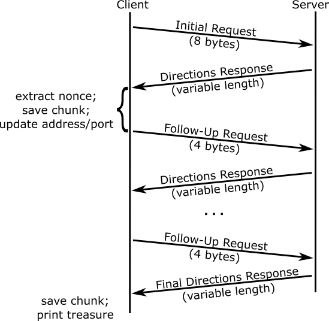

# Socket Treasure Hunt

The purpose of this assignment is to help you become more familiar with the
concepts associated with sockets, including UDP communications, local and
remote port assignment, IPv4 and IPv6, message parsing, and more.


# Maintain Your Repository

 Before beginning:
 - [Mirror the class repository](../01a-hw-private-repo-mirror), if you haven't
   already.
 - [Merge upstream changes](../01a-hw-private-repo-mirror#update-your-mirrored-repository-from-the-upstream)
   into your private repository.

 As you complete the assignment:
 - [Commit changes to your private repository](../01a-hw-private-repo-mirror#commit-and-push-local-changes-to-your-private-repo).


# Table of Contents

 - [Overview](#overview)
 - [Preparation](#preparation)
   - [Reading](#reading)
 - [Instructions](#instructions)
   - [Level 0](#level-0)
   - [Level 1](#level-1)
   - [Level 2](#level-2)
   - [Level 3](#level-3)
   - [Level 4 (Extra Credit)](#level-4-extra-credit)
 - [Helps and Hints](#helps-and-hints)
   - [Message Formatting](#message-formatting)
   - [Error Codes](#error-codes)
   - [Op Codes](#op-codes)
   - [UDP Socket Behaviors](#udp-socket-behaviors)
   - [Testing Servers](#testing-servers)
   - [Logs](#logs)
   - [Debugging Hints](#debugging-hints)
 - [Automated Testing](#automated-testing)
 - [Evaluation](#evaluation)
 - [Submission](#submission)


# Overview

This lab involves a game between two parties: the *client* and the *server*.
The server runs on a CS lab machine, awaiting incoming communications.
The client, also running on a CS lab machine, initiates communications with the
server, requesting the first chunk of the treasure, as well as directions to
get the next chunk.  The client and server continue this pattern of requesting
direction and following direction, until the full treasure has been received.
Your job is to write the client.


# Preparation


## Reading

The man pages for the following are referenced throughout the assignment:

 - `udp(7)`
 - `ip(7)`
 - `ipv6(7)`
 - `socket(2)`, `socket(7)`
 - `send(2)`
 - `recv(2)`
 - `bind(2)`
 - `getaddrinfo(3)`
 - `htons(3)`
 - `ntohs(3)`
 - `getsockname(2)`
 - `getnameinfo(3)`


# Instructions


## Level 0

First, open `treasure_hunter.c` and look around.  You will note that there are
two functions and one `#define` statement.

Replace `PUT_USERID_HERE` with your numerical user ID, which you can find by
running `id -u` on a CS lab machine.  From now on you can use `USERID` as an
integer literal wherever you need to use your user ID in the code.  Note that
`USERID` is not a variable.

Now take a look the `print_bytes()` function.  This function was created to
help you see what is in a given message that is about to be sent or has just
been received.  It is called by providing a pointer to a memory location, e.g.,
an array of `unsigned char`, and a length.  It then prints the hexadecimal
value for each byte, as well as the ASCII character equivalent for values less
than 128 (see `man ascii`).  Note that it is very similar to the `memprint()`
function provided in the
[Strings, I/O, and Environment](../01d-hw-strings-io-env) assignment.


### Command-Line Arguments

Your program should have the following usage:

```
./treasure_hunter server port level seed
```

 - `server`: the domain name of the server.
 - `port`: the port on which the server is expecting initial communications.
 - `level`: the level to follow, a value between 0 and 4.
 - `seed`: an integer used to initialize the pseudo-random number generator on
   the server.

Store each of the arguments provided on the command line (i.e., the `argv`
argument to `main()`) in variables.  Note that `port`, `level`, and `seed` are
numerical values and should ultimately be stored as variables of type `int`.
Because they will be received as strings from the command line (type `char *`),
you will want to convert them to integers with `atoi()`.  However, because
`getaddrinfo()` takes a `char *` for port, you might also want to maintain a
string (`char []`) version of the port as well.

It would be a good idea here to check that all command-line variables have been
stored appropriately from the command line.  Create some print statements to
that effect.  Then build your program by running the following:

```bash
make
```

Then run it:

```bash
./treasure_hunter server 32400 0 7719
```

The output of your program should match the values of the arguments you
provided on the command line.


### Checkpoint 1

Run `./treasure_hunter` with different values for server, port, level, and seed
to make sure everything looks as it should when printed out.  If not, now is
the time to fix it.

Now would also be a good time to save and commit your work.


### Initial Request

The very first message that the client sends to the server should be exactly
eight bytes long and have the following format:

<table border="1">
<tr>
<th>00</th><th>01</th><th>02</th><th>03</th><th>04</th><th>05</th><th>06</th><th>07</th></tr>
<tr>
<td colspan="1">0</td>
<td colspan="1">Level</td>
<td colspan="4">User ID</td>
<td colspan="2">Seed</td></tr>
</table>

The following is an explanation of each field:

 - Byte 0: 0
 - Byte 1: an integer 0 through 4, corresponding to the *level* of the
   course.  This comes from the command line.
 - Bytes 2 - 5: a `unsigned int` corresponding to the user ID of the user in
   network byte order (i.e., big-endian or most significant bytes first).
   You can populate this with the value of `USERID`, for which you created a
   `#define` with the appropriate value.
 - Bytes 6 - 7: an `unsigned short` used, along with the user ID and the level,
   to seed the pseudo-random number generator used by the server, in network
   byte order.  This comes from the command line.

   This is used to allow the client to experience consistent behavior every
   time they interact with the server, to help with development and
   troubleshooting.

In the `main()` function, declare an array of `unsigned char` to hold the bytes
that will make up your request.  Populate that array with values from the
command line.

You might be wondering how to populate the array of `unsigned char` with values
longer than bytes.  Please take a moment to read the section on
[message formatting](#message-formatting), which will provide some background
and some examples for building your message.

Now call `print_bytes()`, specifying the message buffer that you have populated
as the first argument and 8 as your second argument (i.e., because your initial
messages should be exactly 8 bytes).

Re-build and run your file with the following:

```bash
make
./treasure_hunter server 32400 0 7719
```

Check the `print_bytes()` output to make sure that the message you intend to
send looks correct.  For example, assuming a user ID of (decimal) 123456789,
the output would be:

```bash
$ ./treasure_hunter server 32400 1 7719

00: 00 01 07 5B  CD 15 1E 27  . . . [ . . . '
```

To the right of the offset (`00:`) are the following: the byte at index 0,
which should always have value 0 (`00`); the byte at index 1, which has value
1, corresponding to level 1 (`01`); bytes 2 through 5, which represent the user
ID 123456789 (`07 5B CD 15`); and bytes 6 and 7, which represent the seed 7719
(`1E 27`).  Because this message is not "text", there are no useful ASCII
representations of the byte values, so the output on the right is mostly `.`.

Note that you can find the hexadecimal representation of your user ID, the
seed, and any other integer, by running the following from the command line:

Substitute "123456789" with the integer--represented in decimal--that you wish
you represent as hexadecimal.

```bash
printf "%08x\n" 123456789
```


### Checkpoint 2

Run `./treasure_hunter` with different values for server, port, level, and
seed.  Use the `printf` command and the output of `print_bytes()` to verify
that your initial request is being created properly.  If not, now is the time
to fix it.

Now would also be a good time to save and commit your work.

Of course, you have not sent or received any messages at this point, but you
now know how to *format* the initial message appropriately.


### Socket Setup

With your first message created, set up a UDP client socket, with
`getaddrinfo()` and `socket()`, specifying `AF_INET` and `SOCK_DGRAM` as the
address family and socket type, respectively.  Remember that the port passed as
the second argument (`service`) to `getaddrinfo()` is type `char *`.  Thus, if
you only have the port as an integer, then you should convert it (not cast
it!).  You can `sprintf()` to do this.

_Do not call `connect()` on the socket!_  While `connect()` is useful for UDP
(`SOCK_DGRAM`) communications in which the remote address and port will not
change, later in this lab you will be _changing_ the remote address and port
with which you are communicating.  `connect()` cannot be called more than once
on a socket (see the man page for `connect(2)`), so you should instead use
`sendto()` and `recvfrom()`.

The `sendto()` system call uses a `struct sockaddr *` to designate the
remote address and port to which the message should be sent.  That `struct
sockaddr *` actually points to an instance of `struct sockaddr_storage`
(explained subsequently).  Thus, you should declare variables like the
following:

```c
	struct sockaddr_storage remote_addr_ss;
	struct sockaddr *remote_addr = (struct sockaddr *)&remote_addr_ss;
```

In the example above, `remote_addr_ss` is the variable in which the values are
actually stored.  However, most of the system calls use type
`struct sockaddr *`, so the code above assigns `remote_addr` to the address of
`remote_addr_ss`.  Since `remote_addr` points to `remote_addr_ss`, you can use
`remote_addr` for everything instead of `remote_addr_ss`.  The
[sockets homework assignment](../07-hw-sockets) has examples of this.

You are probably asking yourself why all the hassle with
`struct sockaddr_storage` and `struct sockaddr`. It is a bit confusing!  The
reason is that that there are two types of IP addresses: IPv4 and IPv6.  Since
the former is 32 bits long, and the latter is 128 bits long, they have
different storage requirements.  Thus, there is a `struct sockaddr_in` for IPv4
and a `struct sockaddr_in6` for IPv6.  Instead of making two versions of every
function and system call that takes an address as an argument -- one for
`struct sockaddr_in *` and one for `struct sockaddr_in6 *` -- they use a
generic `struct sockaddr_storage` storage structure and point to it with a
`struct sockaddr *`.  This is C's version of polymorphism.

All that being said, we have simplified things in this lab so that you just
need to declare `remote_addr_ss` and `remote_addr`, as shown above, and use
`remote_addr` for everything afterwards.

Each entry of the results list populated by `getaddrinfo()` contains a member
`ai_addr` which is a `struct sockaddr *`.  You can copy the value pointed to by
`ai_addr` to the structure pointed to by `remote_addr` using something like
this:

```c
		memcpy(remote_addr, rp->ai_addr, sizeof(struct sockaddr_storage));
```

See the original `client.c` file in the
[sockets homework assignment](../07-hw-sockets) for the example code from which
this came.

The `parse_sockaddr()` and `populate_sockaddr()` helper functions
have been provided for you in [../code/sockhelper.c](../code/sockhelper.c) to
extract the address and port from a `struct sockaddr_storage` or populate the
`struct sockaddr_storage` with a given address and port, respectively.  Thus,
you can maintain the IP address and port in separate variables as follows:

```c
	char remote_ip[INET6_ADDRSTRLEN];
	unsigned short remote_port;
```

And you can populate the structure pointed to by `remote_addr` with the proper
address and port values with something like this:

```c
	populate_sockaddr(remote_addr, addr_fam, remote_ip, remote_port);
```

Note that `addr_fam` refers to the address family, which is an integer (type
`int`) having a value of either `AF_INET` (IPv4) or `AF_INET6` (IPv6).

Working with a string (`char *`) for IP address and an `unsigned short` for
port is a little more intuitive than working strictly with instances of `struct
sockaddr_storage`.

Finally, you will want to do something similar for keeping track of the local
address and port.  Because the kernel _implicitly_ assigns the local address
and port to a given socket when none has been _explicitly_ assigned using
`bind()`, you should learn the port that has been assigned using
`getsockname()` and save it to a `struct sockaddr *` that points to a `struct
sockaddr_storage`.  For example:

```c
	struct sockaddr_storage local_addr_ss;
	struct sockaddr *local_addr = (struct sockaddr *)&local_addr_ss;

	char local_ip[INET6_ADDRSTRLEN];
	unsigned short local_port;
```

Then:

```c
	socklen_t addr_len = sizeof(struct sockaddr_storage);
	s = getsockname(sock, local_addr, &addr_len);
	parse_sockaddr(local_addr, local_ip, &local_port);
```

Note that for levels 0 through 3, your client will only use IPv4 (i.e.,
`AF_INET`), so the value for `addr_fam` will always be the same.  Nonetheless,
keeping track of it is good practice, and you will find it useful in for
[level 4 (extra credit)](#level-4-extra-credit) when IPv6 is added.

The `client.c` file in the [sockets homework assignment](../07-hw-sockets) has
examples of this.


### Sending and Receiving

When everything is set up, send your message using `sendto()`.
As part of the [sockets homework assignment](../07-hw-sockets) you modified
`client.c` to use `sendto()` by passing it a `struct sockaddr *` that points to
an instance of `struct sockaddr_storage`.  You stored this is in the file
`client-udp.c`.  You can use this for reference.

After the call to `sendto()`, read the server's response with single a call to
`recvfrom()` Remember, with UDP (type `SOCK_DGRAM`) it is just one call to
`sendto()` and one call to `recvfrom()`!  There is no need to loop.

Store the return value of `recvfrom()`, which reflects the number of bytes you
received.  Unlike the [initial request](#initial-request) you sent, which is
always eight bytes, the size of the response is variable (but will never be
more than 256 bytes).

Finally, use `printf()` to print out the size of the respone, and call
`print_bytes()` to print out the contents of the message received by the
server.

Re-build and re-run your program.

At this point, you need to supply the hostname corresponding to an actual
server. See [this section](#testing-servers) for a list of servers and ports
that you may use.  Replace "server" with one of those servers.  Port will
always be 32400.

```bash
make
./treasure_hunter server 32400 0 7719
```

Also try running the with `strace`, which will allow you to see the `sendto()`
and `recvfrom()` system calls, including when (and whether or not!) they
return.

(Replace "server" with the hostname of an actual server.)

```bash
strace -xe trace=sendto,recvfrom ./treasure_hunter server 32400 0 7719
```

That will produce output that will include something like this:

```
sendto(3, "\x00\x01\x07\x5b\xcd\x15\x1e\x27", 8, 0, {sa_family=AF_INET, sin_port=htons(32400), sin_addr=inet_addr("192.0.2.1")}, 128) = 8
recvfrom(3, "\x04\x61\x62\x63\x64\x01\xbe\xef\x12\x34\x56\x78", 512, 0, {sa_family=AF_INET, sin_port=htons(32400), sin_addr=inet_addr("192.0.2.1")}, [128 => 16]) = 12
```

This shows you:
 - for the `sendto()` call:
   - the file descriptor used: fd 3, corresponding to your socket
   - the data that was sent: bytes `00 01 07 5b cd 15 1e 27` (hexadecimal)
   - the remote address and port to which the data was sent: 192.0.2.1 port 32400
 - for the `recvfrom()` call:
   - the file descriptor used: fd 3, corresponding to your socket
   - the data that was received: `04 61 62 63 64 01 be ef 12 34 56 78`
     (hexadecimal)
   - the remote address and port from which the data was received: 192.0.2.1
     port 32400
Use this output to double-check what you think you are sending and receiving
against what you are actually sending and receiving.


### Checkpoint 3

All of the system calls (e.g., `socket()`, `sendto()`, `recvfrom()`) should be
returning successfully.  If that is not the case, now is the time to fix it.
Check the return value, and use `perror()` when a system call fails.


### Directions Response

Take a look at the response from the server, as printed by `print_bytes()`.
Responses from the server are of variable length (but any given message will
consist of fewer than 256 bytes) and will follow this format:

<table border="1">
<tr>
<th>00</th><th>01</th><th>::</th><th>n</th><th>n + 1</th><th>n + 2</th><th>n + 3</th><th>n + 4</th>
<th>n + 5</th><th>n + 6</th><th>n + 7</th></tr>
<tr>
<td colspan="1">Chunk Length</td>
<td colspan="3">Chunk</td>
<td colspan="1">Op Code</td>
<td colspan="2">Op Param</td>
<td colspan="4">Nonce</td></tr>
</table>

The following is an explanation of each field:

 - Byte 0: an `unsigned char`.
   - If 0: the hunt is over.  All chunks of the treasure have been received in
     previous messages from the server.  At this point the client can exit.
   - If between 1 and 127: A chunk of the message, having length corresponding
     to the value of byte 0, immediately follows, beginning with byte 1.
   - If greater than 127: The server detected an error and is alerting the
     client of the problem, with the value of the byte corresponding to the
     error encountered.  See [Error Codes](#error-codes) for more details.
   Note that in the case where byte 0 has value 0 or a value greater than 127,
   the entire message will only be one byte long.

 - Bytes 1 - `n` (where `n` matches the value of byte 0; only applies where `n`
   is between 1 and 127): The chunk of treasure that comes immediately after
   the one received most recently.

 - Byte `n + 1`: This is the op-code, i.e., the "directions" to follow to get
   the next chunk of treasure and the next nonce.  At this point, the op-code
   value you get from the server should be 0, which means "communicate with the
   server the same way you did before" or simply "no change." For future
   levels, this field will have values other than 0, each of which will
   correspond to a particular change that should be made with regard to how you
   contact the server.  See [Op Codes](#op-codes) for a summary, and the
   instructions for levels [1](#level-1), [2](#level-2), [3](#level-3), and
   [4](#level-4-extra-credit) for a detailed description of each.

 - Bytes `n + 2` - `n + 3`: These bytes, an `unsigned short` in network byte
   order, is the parameter used in conjunction with the op-code.  For op-code 0,
   the field exists, but can simply be ignored.

 - Bytes `n + 4` - `n + 7`: These bytes, an `unsigned int` in network byte
   order, is a nonce.  The value of this nonce, plus one, should be returned in
   every communication back to the server.

Extract the chunk length, the treasure chunk, the op-code, the op-param,
and the nonce using the hints in the [message formatting](#message-formatting)
section), storing them in variables of the appropriate types, so you can work
with them.  For example, if a value has a length of one byte, then use an
`unsigned char`, or if a value has a length of two bytes, use an
`unsigned short`, etc.  Because the treasure chunk will consist of ASCII
characters, it can be stored using a `char []`.  However, remember to add a
null byte after the treasure chunk, or `printf()` will not know how to treat it
properly.

Print out the value of each variable to verify that you
have extracted them properly, and pay attention to endian-ness for variables
that consume multiple bytes.  For example, suppose you you receive a directions
response that results in the following output from `print_bytes()`:

```bash
00: 04 61 62 63  64 01 BE EF  . a b c d . . .
08: 12 34 56 78               . 4 V x        
```

printing out the value of the variables associated with each value extracted
from the directions response.  For example:

```c
printf("%x\n", chunklen);
printf("%s\n", chunk); // <-- Remember, this will only work
                     // if you have null-terminated the chunk!
printf("%x\n", opcode);
printf("%x\n", opparam);
printf("%x\n", nonce);
```

should result in the following output:

```
4
abcd
1
beef
12345678
```

Note that the op-param has no use for level 0, and the value might actually
be 0.  This means that endian-ness for op-param is hard to check at this point.
But you can check the others, and you can check op-param in future levels when
the value is non-zero.

You will be sending the nonce (well, a variant of it) back to the server, in
exchange for additional chunks, until you have received the whole treasure.


### Checkpoint 4

Run `./treasure_hunter` against the same server and port as before but with
different values for level and seed to make sure everything looks as it should
when printed out.  If not, now is the time to fix it.

Now would also be a good time to save and commit your work.


### Follow-Up Request

After the initial request, every subsequent request will be exactly four bytes
and will have the following format:

<table border="1">
<tr>
<th>00</th><th>01</th><th>02</th><th>03</th></tr>
<tr>
<td colspan="4">Nonce + 1</td></tr>
</table>

 - Bytes 0 - 3: an `unsigned int` having a value of one more than the nonce
   most recently sent by the server, in network byte order.  For example, if
   the server previously sent 0x12345678 as the nonce, then this value should
   be 0x12345679.

Build your follow-up request using the guidance in the
[message formatting helps](#message-formatting) section, and use
`print_bytes()` to make sure it looks the way it should.

Re-build and re-run your program:

```bash
make
./treasure_hunter server 32400 0 7719
```

Make sure the bytes are in the correct order!  For example, if you received the
nonce 0x12345678 as the nonce, then `print_bytes()` should produce the
following for the return message:

   ```bash
   00: 12 34 56 79               . 4 V y        
   ```

If everything looks good, then use `sendto()` to send your follow-up request
and `recvfrom()` to receive your next directions response.


### Checkpoint 5

Run `./treasure_hunter` against the same server and port, specifying level 0,
but different values for seed.  Verify that the contents of your follow-up
request match the value of the nonce sent by the server, plus one.  Also, check
that the `sendto()` call returns successfully.  If that is not the case, now is
the time to fix it.

Now would also be a good time to save and commit your work.


### Program Output

Now generalize the pattern of sending
[follow-up requests](#follow-up-request) in response to
[directions responses](#directions-response), receiving the entire treasure,
one chunk at a time.  Append each new chunk received to the chunks you already
have.  Remember to add a null byte after the characters comprising your
total treasure, so you can use `printf()` with the treasure!

You should create a loop whose termination test is whether or not the entire
treasure has been received.  That is, you should break out of the loop when
byte 0 of the directions response [has a value of 0](#directions-response)).

The overall interaction is illustrated in the following image:



Once your client has collected all of the treasure chunks, it should print the
entire treasure to standard output, followed by a newline (`\n`).  For example,
if the treasure hunt yielded the following chunks:

 - `abc`
 - `de`
 - `fghij`

Then the output would be:

```
abcdefghij
```

No treasure will be longer than 1,024 characters, so you may use that as your
buffer size.

At this point, make sure that the treasure is the only program output.  Remove
print statements that you have added to your code for debugging by commenting
them out or otherwise taking them out of the code flow (e.g., with
`if (verbose)`).


### Checkpoint 6

At this point, you can also test your work with
[automated testing](#automated-testing).  Level 0 should work at this point.

Now would be a good time to save your work, if you haven't already.


## Level 1

With level 0 working, you have a general framework for client-server
communications.  The difference now is that the directions response will
contain real actions.

For level 1, responses from the server will use op-code 1.  The client should
be expected to do everything it did at level 0, but when op-code 1 is provided
in the [directions response](#directions-response), it should extract the
op-param (bytes `n + 2` and `n + 3`) from the response and use that value as
the remote port for future communications with the server.  That value is an
`unsigned short` stored in network byte order (see
[Directions Response](#directions-response) and
[Message Formatting](#message-formatting)).

Some guidance follows as to how to use the new remote port in future
communications.

It was recommended [previously](#sending-and-receiving) that you keep track of
the remote addresses and ports in the `remote_ip` and `remote_port` variables,
so you can populate `remote_addr` with the proper values by calling
`populate_sockaddr()`.  Thus, after receiving the directions response from the
server and extracting the new remote port, you can just do something like this:

```c
	populate_sockaddr(remote_addr, addr_fam, remote_ip, remote_port);
```

Of course, `remote_ip` should still contain the appropriate IP address.

Just as with level 0, have your code
[collect all the chunks and printing the entire treasure to standard output](#program-output).


### Checkpoint 7

At this point, you can also test your work with
[automated testing](#automated-testing).  Levels 0 and 1 should both work at
this point.

Now would be a good time to save your work, if you haven't already.


## Level 2

For level 2, responses from the server will use either op-code 1 or op-code 2,
selected at random.  The client should be expected to do everything it did at
levels 0 and 1, but when op-code 2 is provided in the
[directions response](#directions-response), it should extract the op-param
(bytes `n + 2` and `n + 3`) from the response and use that value as the local
port for future communications with the server.  That value is an
`unsigned short` stored in network byte order (see
[Directions Response](#directions-response) and
[Message Formatting](#message-formatting)).

Association of a local address and port to a socket is done with the `bind()`
function.  `bind()` cannot be called on a socket after a local address and port
have been assigned to that socket -- whether explicitly with `bind()` or
implicitly after a call to `sendto()`.  Therefore, every time the client is
told to use a new local port (i.e., with op-code 2 in a directions response),
_the current socket must be closed_, and a new one must be created.  Then
`bind()` is called on the new socket.

It was recommended [previously](#sending-and-receiving) that you keep track of
the local address and port in the `local_ip` and `local_port` variables, so you
can populate `local_addr` and `local_port` with the proper values by calling
`populate_sockaddr()`.  Thus, after receiving the directions response from the
server and extracting the new local port, you can just do something like this:

```c
	populate_sockaddr(local_addr, addr_fam, NULL, local_port);
```

(Note that the `local_addr` can be `NULL`, which tells the system to use
whichever address makes sense.)

At this point you can call `bind()` on the socket, passing `local_addr`, which
refers to the local address and port:

```c
	if (bind(sock, local_addr, sizeof(struct sockaddr_storage)) < 0) {
		perror("bind()");
	}
```

Again, the `server.c` file of the
[sockets homework assignment](../07-hw-sockets) has examples of this.


### Checkpoint 8

At this point, you can also test your work with
[automated testing](#automated-testing).  Levels 0 through 2 should all work
at this point.

Now would be a good time to save your work, if you haven't already.


## Level 3

For level 3, responses from the server will use any of op-code 1, 2, or 3,
selected at random.  The client should be expected to do everything it did at
levels 0 through 2, but also support op-code 3.  When op-code 3 is provided in
the [directions response](#directions-response), the client should do the
following to prepare the next directions request:

 - Extract the op-param (bytes `n + 2` and `n + 3`) as an `unsigned short` in
   network byte order.  The extracted value will be referred to hereafter as
   `m`.   While `m` takes up two bytes, for consistency with op-params used
   with other op-codes, its value will be only between 1 and 7, which means
   that the most significant byte will always be 0.
 - Read `m` datagrams from the socket using the _local_ port to which the
   socket is already bound.  Each of these datagrams will come from a
   randomly-selected _remote_ port on the server, so `recvfrom()` must be used
   by the client to read them to determine which port they came from.  You
   should declare new `struct sockaddr_storage` and `struct sockaddr *`
   variables for use with `recvfrom()`, so you don't overwrite the value of
   your `remote_addr_ss` variable.  The next directions request will be sent to
   that address and port, once it is prepared.

   Each of the `m` datagrams received will have 0 length.  However, the contents
   of the datagrams are not what is important; what is important is the remote
   _ports_ from which they originated (i.e., the _remote_ ports populated with
   `recvfrom()`).
 - Sum the values of the remote ports of the `m` datagrams to derive the nonce.
   Remember the following:

   - Each of the ports must be in host order before its value is added (Hint:
     use `ntohs()`).
   - The sum of the ports might overflow the 16 bits associated with an
     `unsigned short` (16 bits), so you will want to keep track of their
     _sum_ with an `unsigned int` (32 bits).
 - Add 1 to the nonce, and prepare the new directions request with that value.
 - Send the directions request with the same local and remote ports with which
   the most recent directions request was sent--not the ones from which you
   received the `m` datagrams.


### Checkpoint 9

At this point, you can also test your work with
[automated testing](#automated-testing).  Levels 0 through 3 should all work
at this point.

Now would be a good time to save your work, if you haven't already.


## Level 4 (Extra Credit)

For level 4, responses from the server will use any of op-code 1, 2, 3, or 4,
selected at random.  The client should be expected to do everything it did at
levels 0 through 3, but also support op-code 4.  When op-code 4 is provided in
the [directions response](#directions-response), the client should do the
following the prepare the next directions request:

 - Extract the op-param (bytes `n + 2` and `n + 3`) from the response and use
   that value as the remote port for future communications with the server.
   This part is the same as with [op-code 1](#level-1).
 - Call `getaddrinfo()` with a `hints.ai_family` value corresponding to
   whichever family was _not_ being used before.  If IPv4 (`AF_INET`) was in
   being used, then switch to IPv6 (`AF_INET6`) and vice-versa.  Use the new
   port as the second argument to `getaddrinfo()`  Remember to convert it to a
   string using `sprintf()`.  Follow the instructions from
   [Sending and Receiving](#sending-and-receiving) to create and prepare your
   socket with the return values of `getaddrinfo()`.
 - Remember to save your remote and local address and port information as shown
   [previously](#sending-and-receiving).
 - Update the value of the `addr_fam` variable.
 - Close the old socket.  It is no longer needed!


Note that handling a socket that might be one of two different address families
requires a bit of logical complexity.


### Checkpoint 10

At this point, you can also test your work with
[automated testing](#automated-testing).  Levels 0 through 4 should all work
at this point.

Now would be a good time to save your work, if you haven't already.


# Helps and Hints

## Message Formatting

When writing to or reading from a socket, a buffer must be specified.  This can
be a pointer to data at any memory location, but the most versatile data
structure is an array of `unsigned char`.

For example, in preparing the initial directions request to the server, a
buffer might be declared like this:

```c
unsigned char buf[64];
```

If that initial message has values 1, 3985678983 (0xed90a287), and 7719
(or, equivalently, 0x1e27) for level, user ID, and seed, respectively, the
values stored in that buffer might look like this, after it is populated:

```c
buf = { 0, 1, 0xed, 0x90, 0xa2, 0x87, 0x1e, 0x27 };
```

Of course, you cannot simply populate the array with the above code because the
values will not be known ahead of time.  You will need to assign them.  So how
do you fit an `unsigned short` (16 bits) into multiple slots of `unsigned
char` (8 bits)?  There are several ways.  Consider the following program:

```c
#include <stdio.h>
#include <string.h>
#include <arpa/inet.h>

#define BUFSIZE 8

int main() {
	unsigned char buf[BUFSIZE];

        // initialize buf to 0
	bzero(buf, BUFSIZE);

        unsigned short val = 0xabcd;
	
	memcpy(&buf[6], &val, sizeof(unsigned short));
	for (int i = 0; i < BUFSIZE; i++) {
		printf("%x ", buf[i]);
	}
	printf("\n");
}
```

When you compile and run this program, you will see that indexes 6 and 7 of
`buf` contain the value of `val`, exactly as they are stored in memory; that is
what the call to `memcpy()` is doing.  You will *most likely* find them to be
in the *reverse* order from what you might expect.  If so, is because the
architecture that you are using is *little endian*.  This is problematic for
network communications, which expect integers to be in *network* byte order
(i.e., *big endian*).  To remedy this, there are functions provided for you by
the system.  In order to use mult-byte integers for any computation (e.g.,
printing them out, incrementing them, using them to index into an array, etc.),
those integers need to be in *host* byte order.  For short integers (i.e.,
`short` and `unsigned short`), the proper functions to use are the following:

 - `htons()` - "host to network short", convert the byte order from host order
   to network order.
 - `ntohs()` - "network to host short", convert the byte order from network
   order to host order.

If you modify the code above to use `val = htons(0xabcd)` you will see that the
output now changes such that the bytes are in the proper order.  For long
integers (including `int` and `unsigned int`), the proper functions to use are
the following:

 - `htonl()` - "host to network long", convert the byte order from host order
   to network order.
 - `ntohl()` - "network to host long", convert the byte order from network
   order to host order.

Just as you need to convert any multi-byte integer that you _received_ from the
the network to host byte order, for any multi-byte integer that you wish to
_send_ in an outgoing message, you need to convert it to network byte order.


## Error Codes

Any error codes sent by the server will be one of the following:

 - 129 (0x81): The message was sent from an unexpected port (i.e., the source port of
   the packet received by the server).
 - 130 (0x82): The message was sent to the wrong port (i.e., the remote port of the
   packet received by the server).
 - 131 (0x83): The message had an incorrect length.
 - 132 (0x84): The value of the nonce was incorrect.
 - 133 (0x85): After multiple tries, the server was unable to bind properly to the
   address and port that it had attempted.
 - 134 (0x86): After multiple tries, the server was unable to detect a remote port on
   which the client could bind.
 - 135 (0x87): A bad level was sent the server on the initial request, or the first
   byte of the initial request was not zero.
 - 136 (0x88): A bad user id was sent the server on the initial request, such that a
   username could not be found on the system running the server.
 - 137 (0x89): An unknown error occurred.
 - 138 (0x8a): The message was sent using the wrong address family (i.e., IPv4 or
   IPv6).


## Op-Codes

The op-codes sent by the server will be one of the following:

 - 0: Communicate with the server as you did previously, i.e., don't change the
   remote or local ports, nor the address family.
 - 1: Communicate with the server using a new remote (server-side) port
   designated by the server.
 - 2: Communicate with the server using a new local (client-side) port
   designated by the server.
 - 3: Same as op-code 0, but instead of sending a nonce that is provided by the
   server, derive the nonce by adding the remote ports associated with the `m`
   communications sent by the server.
 - 4: Communicate with the server using a new address family, IPv4 or
   IPv6--whichever is not _currently_ being used.


## UDP Socket Behaviors

For this lab, all communications between client and server are over UDP (type
`SOCK_DGRAM`).  As such, the following are tips for socket creation and
manipulation:

 - Sending every message requires exactly one call to `write()`, `send()`, or
   `sendto()`.  See the man page for `udp(7)`.
 - Receiving every message requires exactly one call to `read()`, `recv()`, or
   `recvfrom()`.  In some cases (e.g., op-code 3) `recvfrom()` _must_ be used.
   See the man page for `udp(7)`.
 - When 0 is returned by a call to `recvfrom()` on a socket of type
   `SOCK_DGRAM`, it simply means that there was no data/payload in the datagram
   (i.e., it was an "empty envelope").  See "RETURN VALUE" in the `recvfrom()`
   man page.

   Note that this is different than the behavior associated with a socket of
   type `SOCK_STREAM`, in which if `read()` or `recv()` returns 0, it is a
   signal that `close()` has been called on the remote socket, and the
   connection has been shut down.  With UDP (type `SOCK_DGRAM`), there is no
   connection to be shut down.


## Testing Servers

The following hostnames and ports (format: "hostname:port") correspond to the
servers where the games might be initiated.

 - alaska:32400
 - arkansas:32400
 - california:32400
 - connecticut:32400
 - falcon:32400
 - florida:32400
 - groot:32400
 - hawaii:32400
 - hawkeye:32400
 - hulk:32400
 - rogers:32400
 - wanda:32400

Note that all servers provide exactly the same behavior.  However, to balance
the load and to avoid servers that might be down for one reason or another, we
have created the following script, which will show both a status of servers the
primary hostname and port that you should use:

```
./server_status.py
```


## Debugging Hints

 - Check the return values to all system calls, and use `perror()` to print out
   the error message if the call failed.  Sometimes it is appropriate to call
   `exit()` with a non-zero value; other times it is more appropriate to clean
   up and move on.
 - Place helpful print statements in your code, for debugging.  Use
   `fprintf(stderr, ...)` to print to standard error.
 - Use the program `strace` to show you information about the datagrams you are
   sending and receiving in connection with the `sendto()` and `recvfrom()`
   system calls.  `strace` can be used with various command-line options to
   cater it to your needs.  For example, the following command:

   ```bash
   strace -xe trace=sendto,recvfrom ./treasure_hunter ...
   ```

   calls `strace` on `./treasure_hunter`, showing only the systems calls:
   `sendto()` and `recvfrom()`.  By reading the `strace` output, you can
   compare the the data you are actually sending and receiving with the data
   that you _think_ you are sending and receiving.  You can also see the remote
   address port associated with `sendto()` and `recvfrom()` calls and compare
   those with the remote address and port with which you _think_ you are
   communicating.
 - If a socket operation like `recvfrom()` results in a "Bad Address" error, it
   is often because the `addr_len` parameter had an incorrect value.  The
   `addr_len` parameter should contain a pointer to (the address of) a value
   corresponding to the length of the address struct being used to receive the
   value.  Typically this is done with running the following immediately before
   calling the system call (e.g., `recvfrom()`);

   ```c
   addr_len = sizeof(struct sockaddr_storage);
   ```
 - If your program receives error code 133 (0x85), it means that the server was
   unable to detect a remote port on which the client could call `bind()`.
   Sometimes this is because your program is (accidentally) running multiple
   times on your system and is thus occupying the ports that the server is
   asking your program to use.  Try running the following to see if any other
   `treasure_hunter` processes are running as your user:

   ```bash
   ps -fu $USER | grep treasure_hunter
   ```

   To terminate them, simply run:

   ```bash
   killall treasure_hunter
   ```
 - If a call to `recv()` or `recvfrom()` blocks indefinitely -- particularly
   with level 1 or level 3 -- it could be that it is because the remote address
   and port have been set with `connect()` and the server cannot receive from
   an arbitrary address and port.  Please double-check that you are not using
   `connect()`.
 - All communications received by the servers are logged to files that are
   accessible to the TAs.  If you are having trouble tracking down the cause of
   faulty behavior, you may ask a TA to look for entries in the logs
   corresponding to your activity.


# Automated Testing

For your convenience, a script is also provided for automated testing.  This is
not a replacement for manual testing but can be used as a sanity check.  You
can use it by simply running the following:

(Replace "server" and "port" with a server and port from the set of
[servers designated for testing](#testing-servers), preferably the one
corresponding to your username.)

(Specifying `level` is _optional_.  If _specified_, then it will test
[all seeds](#evaluation) against a given level.  If _not_ specified, it will
test _all_ levels.)

```
./driver.py server port level
```


# Evaluation

Your score will be computed out of a maximum of 100 points based on the
following distribution:

 - 5 points for compilation without warnings
 - 50 points for passing level 0
 - 15 points each for passing levels 1 through 3
 - For each level, 3 points for each seed:
   - 7719
   - 33833
   - 20468
   - 19789
   - 59455
 - 5 points extra credit for level 4


# Submission

Upload `treasure_hunter.c` to the assignment page on LearningSuite.
