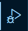
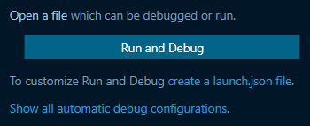
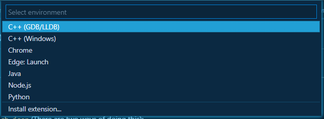
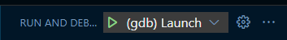
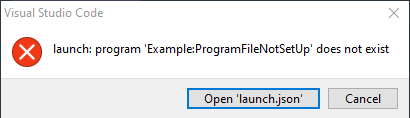
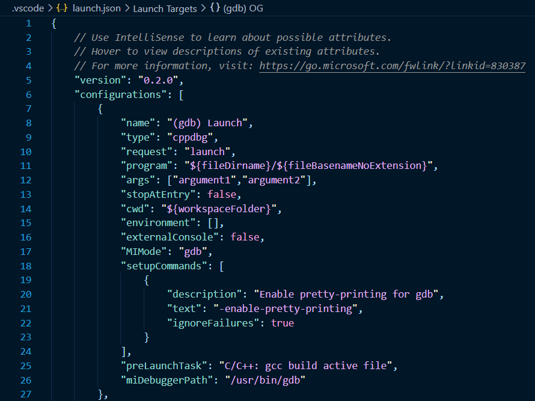

# Troubleshooting and Setting Up the VS Code Debugger

*Written by Grant Lewis - (March 2022)*

---

## First Time? Start Here

- If this is your first time using the debugger in VS Code, you probably need to configure your `launch.json` file.
    - Open `launch.json` (There are two ways of doing this):

        a. Either Open the the debugging paine on the left

        
        
        - Click `Run and Debug` and then click `C++ (GDB/LLDB)` if you see something like below.

        

        

        - If you see something like below, click the gear icon (near the play button).

        

        b. Or click `open launch.json` if prompted by the error pop-up when attempting to run the debugger

           

    - Double check that the `program` tuple is configured properly. As a reference, I have attached an example configuration.
    - As a last resort, you can try using the example configuration. 
    - **Note:** The `preLaunchTask` and `miDebuggerPath` tuples are optional since the debugger should be able to function without them.

### Example Configuration:

## Still Having Issues?  Here Are Some Suggestions

- Depending on your configuration, you may need to compile your code in the terminal before you can run the debugger.  Try compiling the code in the terminal then rerunning the debugger.  (If this is your issue, make sure you are recompiling your code every time you make changes or you will be running an older version of your code.)
    - A good tell that this is your issue is if your debugger will run, but it seems to stop on lines that don't have breakpoints.

- Make sure that the "active tab/file" (The tab where your cursor currently appears in or whatever file you are currently editing) is the file you are trying to run the debugger on.  You want your active tab to be your .c file.  The debugger usually will try to run whatever the active file is.  (For instance, if you are changing stuff in `launch.json` (See the first bullet) and then start the debugger without changing which file you are looking at, the debugger may try to run using `launch.json` as your .c file which obviously will not work).

## Important note on `launch.json` and the debugger!:

When running the program, `args` inside launch.json allows you to pass in arguments.  These will be comma delimited string values (example in the photo).  If your program needs input arguments to run (ie. a file name, a port number, etc.), this is where you would define them. 
