# Setting Up VS Code to SSH into Lab Machines

*Written by Grant Lewis - (January 2022)*

---

## Why Work on Lab Machines and Why Use VS Code?

**Why Lab Machines?** In this class, you will be completing several lab assignments in the C programming language.  To help standardize and streamline grading, we have built drivers which we will run your code and give you a score based on your programs ability to properly produce outputs based on the requirements.  This drivers will be made available to you upon downloading the resource files so that you can guage progress and understand where your grade on a particular lab sits.  One very important note is that we will be running the driver on the lab machines when we grade you on your labs.  Since different opperating systems (or even different versions) may process and run processies differently, it is ** highly recommended ** that you run the driver and your code on a lab machine when testing so that you get the most accurate idea of what your score may be.  To simplify this process, we reccommend that you cut out the middle man by coding and debugging on the lab machines.   

**Why VS Code?** [Visual Studio Code](https://code.visualstudio.com/) is a free, open source cross-platform editor.  VS Code is a very popular IDE for its versitility and ability to work with most langugages, (unlike programs such as PyCharm or Intellij IDEA which both specialize in one language).  VS Code is a great pick for the CS 324 course since the IDE can easily be set up to allow for remote development via SSH.  By using this feature, you get the benefits of programming on another machine remotely while still enjoying the benefits of an IDE.  This can include IntelliSense, debugging, and much more!  Being able to use Vim/Nano is a valuable skill and comes in handy, however, VS Code can make the coding experience much more enjoyable.  This document will walk through setting up VS Code for remotely accessing university lab machines.

*NOTE: If you have not set up remote access to the lab machines or are having issues with connecting, you can try looking at [this link](https://docs.cs.byu.edu/doku.php?id=setting-up-your-account-with-the-cs-authentication-system)*

---

## Steps

0. *Recommendation Before Starting:* SSH into the lab machines in a normal terminal and create a new folder which you can use for the class.  By default, you will be located in "*~*", which is your home directory, this would be a very convenient location to have your class folder.  To make a folder type the command ```mkdir CS_324```. (If you want to go to your home directory type the command ```cd ~```)

1. [Download](https://code.visualstudio.com/Download) and open Visual Studio Code if you haven't already.

2. On the far left, in the middle of the window, you will see several icons, including files, a magnifine glass, some building blocks, etc.  Click the icon which looks like building blocks entitled "*Extensions*".  (Default shortcut: *Ctrl + Shift + X* or *Cmd + Shift + X*) 


3. In the search bar that appears type ```ssh```.  Click on the extension entitled "*Remote - SSH*".  The extension is produced by Microsoft.  (If you are unsure if you selected the correct extension you can compare it with the one at [this link](https://marketplace.visualstudio.com/items?itemName=ms-vscode-remote.remote-ssh))

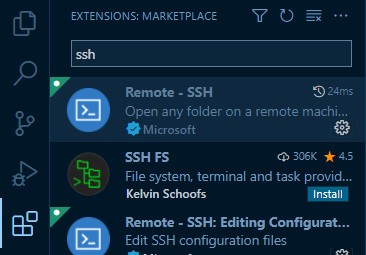

4. Install the selected extension by clicking the "*Install*" button.

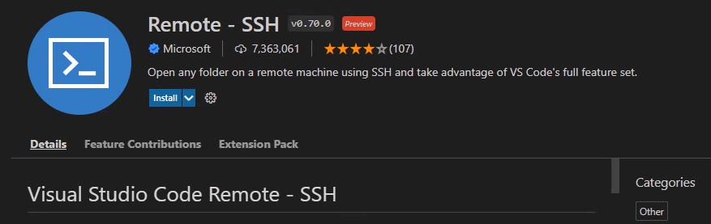

5. Once installed, a new icon will appear on the left by the blocks. Click on this new icon entitled "*Remote Explorer*". (The icon will look like a monitor and some carrot symbols inside of a circle)

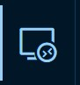

6. Hover over the title of the Remote Explorer pane "*SSH Target*" and click on the "*+*" Icon that appears

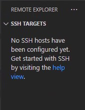
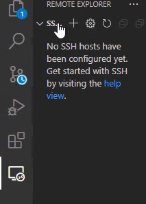

7. In the option box that opened type in the SSH command which you would normally use in a shell. (ie. ```ssh userid@schizo.cs.byu.edu```) Then hit the "*Enter*" key. 

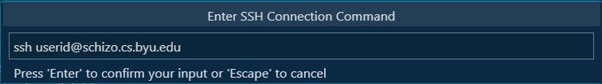

8. *(If a new VS Code window opens automatically skip this step)* In the Remote Explorer pane hover over the new entry for schizo.cs.byu.edu and click the icon that appears. (The icon looks like a window with a plus icon.)  Clicking this icon should open a new VS Code window with a prompt to input your password.

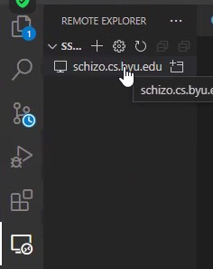

9. You may be given a prompt to select a platform to use.  If this pops up, select "*Linux*".  You should then type in the password you use with the lab machines and hit the "*Enter*" key.

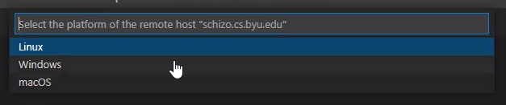

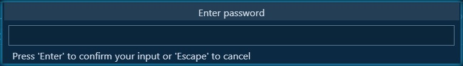

10. After a connection to the lab machines is made, navigate to the *File Explorer* on the left. Then click "*Open Folder*."  A directory path should pop up.


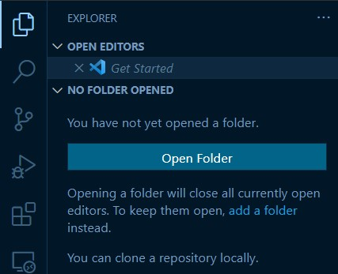

11. In the directoy path pop up navigate to the folder you want to work out of.  In "*Step 0*", it was reccommended that you make a new directory in your home directory.  If you did this, you would simply type in ```CS_324``` (or whatever you named the directory) and hit "*OK*".  You can also select the direcotry in the drop-down list of folders.

*NOTE: You will probably have to reenter your password, this is to be expected when selecting a new folder as your working directory in VS Code.*

## Congratulations!  You should now be able to use the lab machines with VS Code!

---

## How to Access Your Predefined Workspace Setup

By default, when you reopen VS Code, it should reopen the last "workspace" which was open when it was closed.  However, if you were working in a different workspace other than the lab machines, it is easy to reconnect to the workspace.

1. Navigate to the "Remote Explorer" pane.


2. Under "*schizo.cs.byu.edu*", hover over the folder name you selected in "*Step 11*" when setting up VS Code for SSH (ie. "*CS_324*").

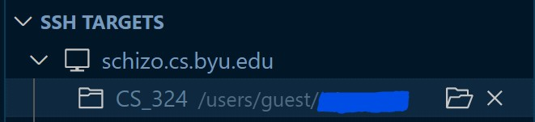

3. Click the "*Open Folder*" icon that appears.  After you log in, you should be ready to go!


